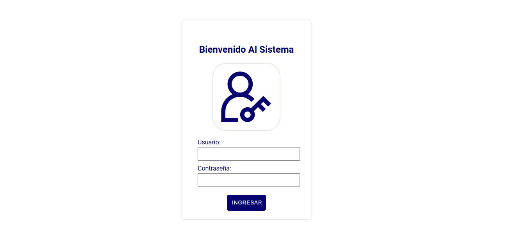

# Formulario Login

Formulario de inicio de sesión con HTML, CSS y JavaScript.

## Funcionalidades
- Validación de usuario y contraseña
- Alertas con SweetAlert2
- Diseño limpio y atractivo

## 📸 Vista previa

Puedes iniciar sesión con los siguientes usuarios:

- **Usuario:** pedro12
  **Contraseña:** 123

- **Usuario:** carlos29
  **Contraseña:** 345

## Cómo usar
1. Clona el repositorio
2. Abre `index.html` en tu navegador
3. Prueba iniciar sesión con los usuarios predefinidos

## 🛠️ Tecnologías usadas

- HTML5
- CSS3
- JavaScript (ES6)
- SweetAlert2

